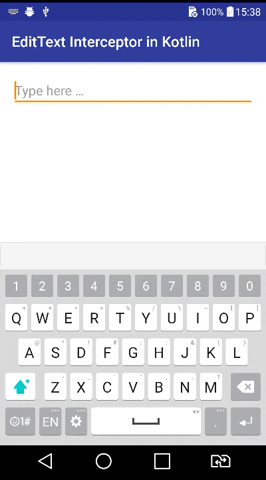
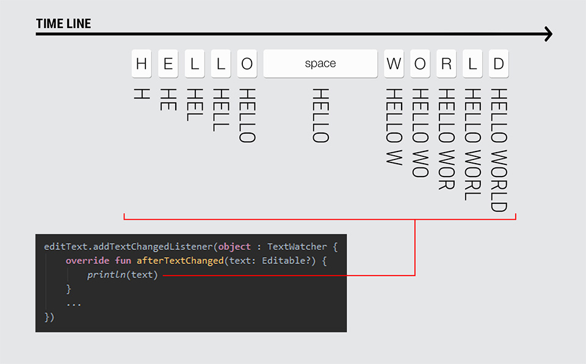
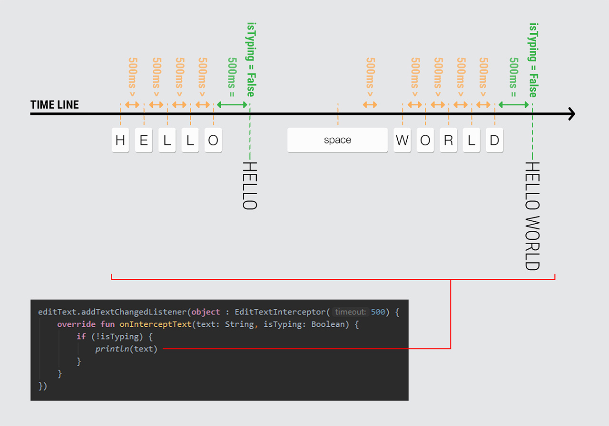

# `EditText Interceptor` :zap:
[](https://android-arsenal.com/details/1/?)
[ ](https://bintray.com/aminography/maven/EditTextInterceptor/_latestVersion)

**`EditTextInterceptor`** is a `TextWatcher` which intercepts on text changes considering a breakable timeout.
Actually, it delivers text changes along with typing status.



<br/>

Suppose you have a search box which runs a query based on user input, on the fly.
Now, if you use an instance of `TextWatcher` to inform about text changes, the only choice is to run a query for each change.



<br/>

Using **`EditTextInterceptor`** you'll be able to run a query after finishing the user typing.
It leads to reduce number of unused queries followed by performance optimization and less resource consumption.



<br/>

Download
--------
**`EditTextInterceptor`** is available on [bintray](https://bintray.com/aminography/maven/EditTextInterceptor) to download using build tools systems. Add the following lines to your `build.gradle` file:

```gradle
repositories {
    jcenter()
}

dependencies {
    implementation 'com.aminography:edittext-interceptor:1.0.2'
}
```

<br/>

Usage
-----
As an instance of **`EditTextInterceptor`** is a `TextWatcher` too, simply pass it to the `EditText.addTextChangedListener()`.

```kotlin
// Intercept timeout is defined 500ms
editText.addTextChangedListener(object : EditTextInterceptor(500) {
    override fun onInterceptText(text: String, isTyping: Boolean) {
        // TODO
    }
})
```

<br/>

License
--------
```
Copyright 2019 Mohammad Amin Hassani.

Licensed under the Apache License, Version 2.0 (the "License");
you may not use this file except in compliance with the License.
You may obtain a copy of the License at

   http://www.apache.org/licenses/LICENSE-2.0

Unless required by applicable law or agreed to in writing, software
distributed under the License is distributed on an "AS IS" BASIS,
WITHOUT WARRANTIES OR CONDITIONS OF ANY KIND, either express or implied.
See the License for the specific language governing permissions and
limitations under the License.
```
