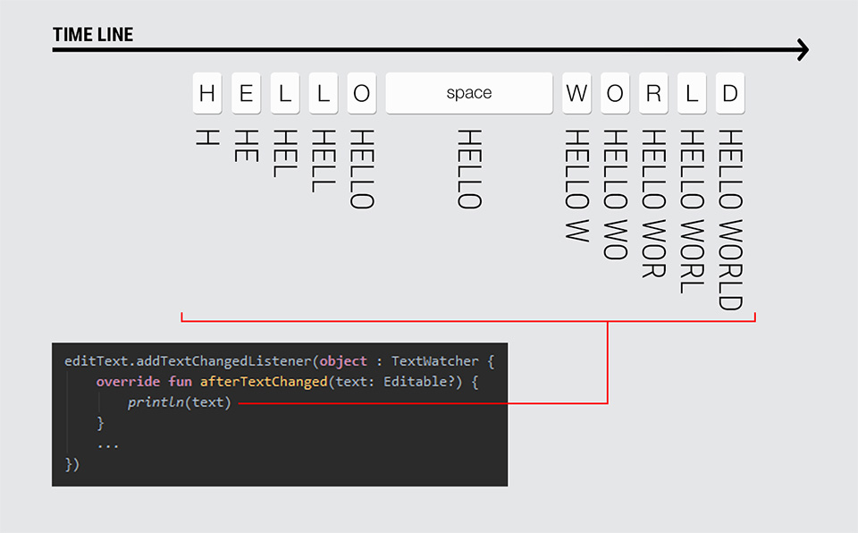
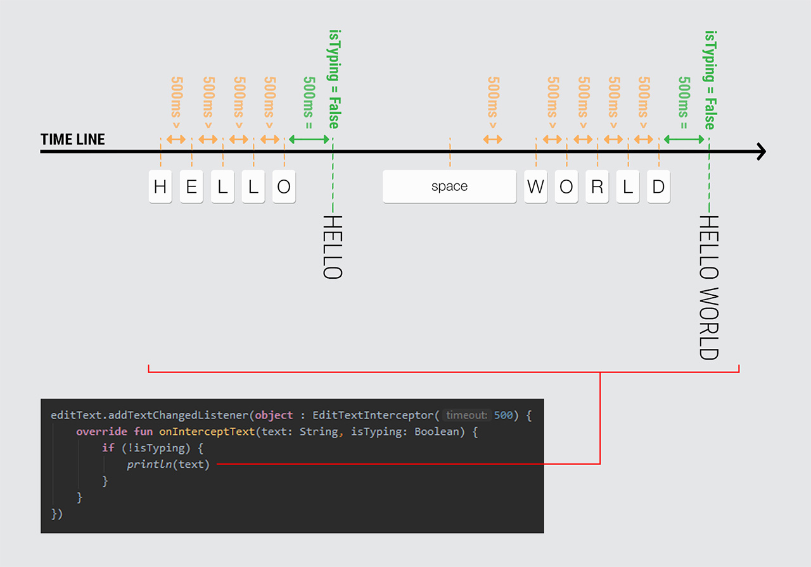

# `EditTextInterceptor` :zap:

**`EditTextInterceptor`** is a `TextWatcher` watching on `EditText` to notify text changes considering a breakable timeout.
I this way, you know when the user typing is finished.



Descriptions



<!---->

<!--Descriptions-->

<!---->

<br/>

Download
--------
**`EditTextInterceptor`** is available on [bintray](https://bintray.com/aminography/maven/EditTextInterceptor) to download using build tools systems. Add the following lines to your `build.gradle` file:

```gradle
repositories {
    jcenter()
}

dependencies {
    implementation 'com.aminography:edittext-interceptor:1.0.1'
}
```

<br/>

Usage
-----
First, ...

<br/>

Change Log
----------
### Version 1.0.0
- Initial Release.

<br/>

License
--------
```
Copyright 2019 Mohammad Amin Hassani.

Licensed under the Apache License, Version 2.0 (the "License");
you may not use this file except in compliance with the License.
You may obtain a copy of the License at

   http://www.apache.org/licenses/LICENSE-2.0

Unless required by applicable law or agreed to in writing, software
distributed under the License is distributed on an "AS IS" BASIS,
WITHOUT WARRANTIES OR CONDITIONS OF ANY KIND, either express or implied.
See the License for the specific language governing permissions and
limitations under the License.
```
